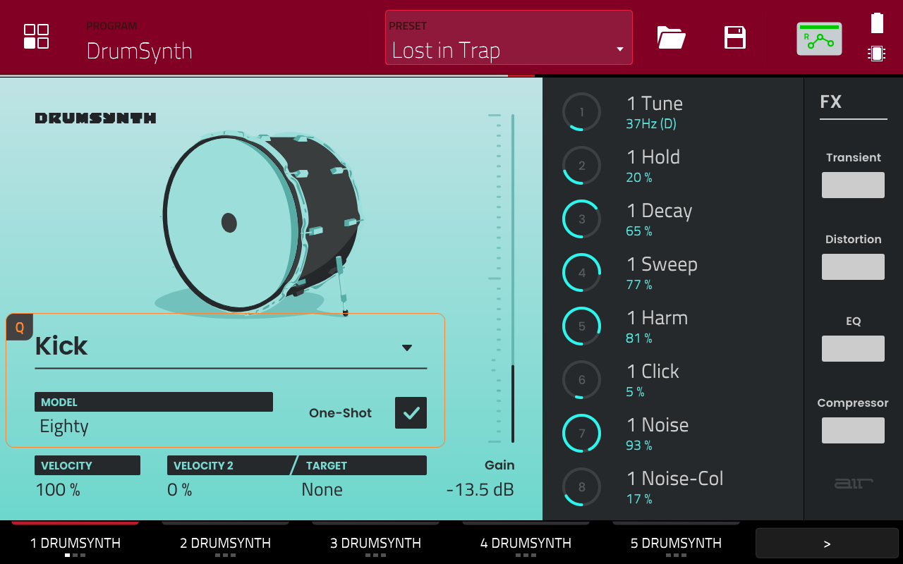
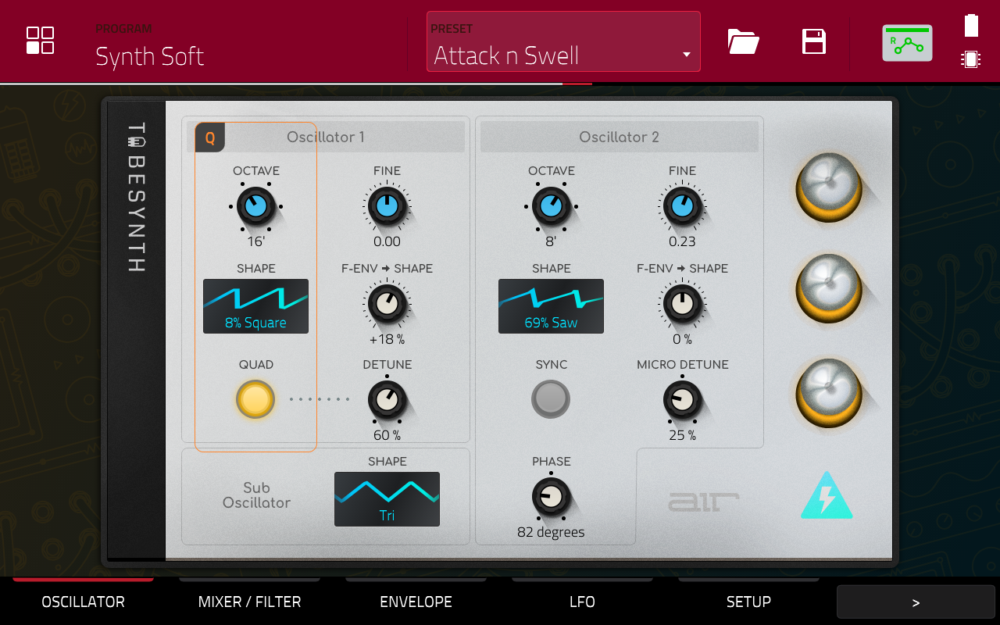
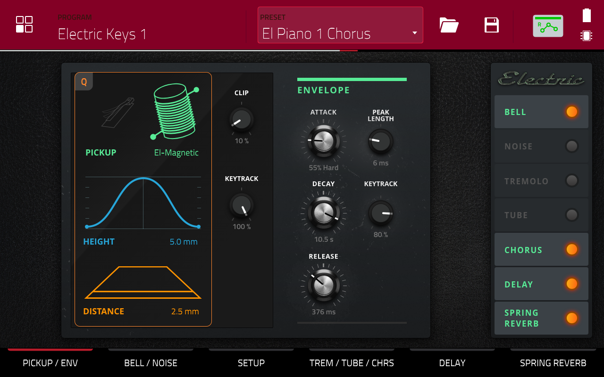
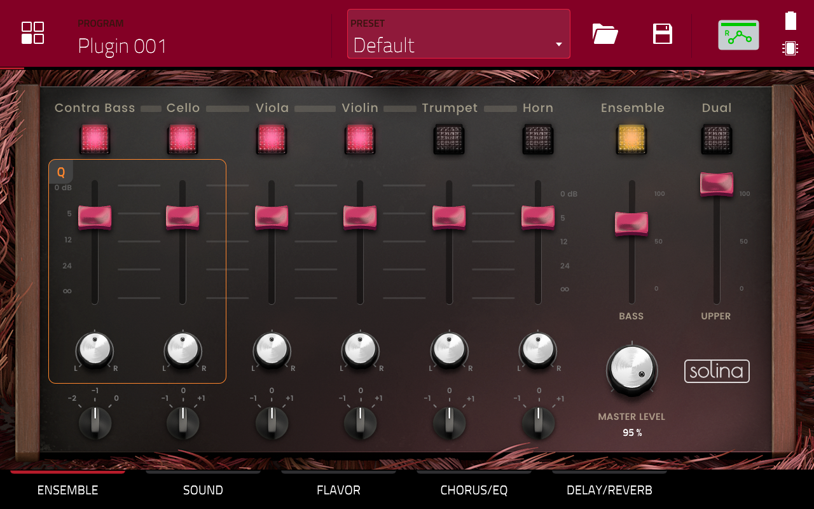
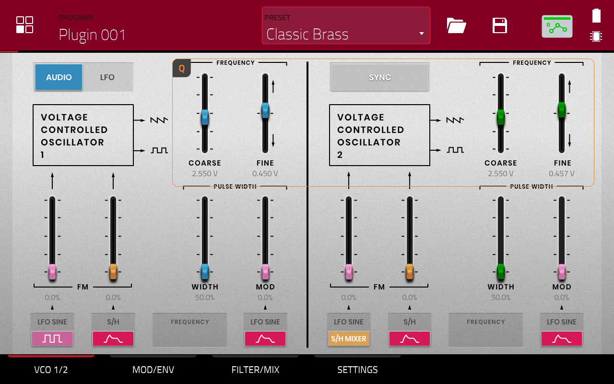
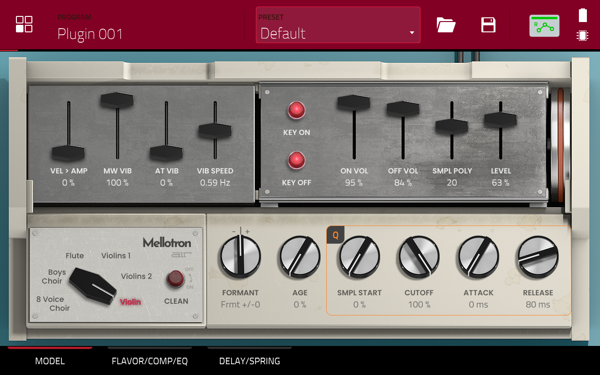
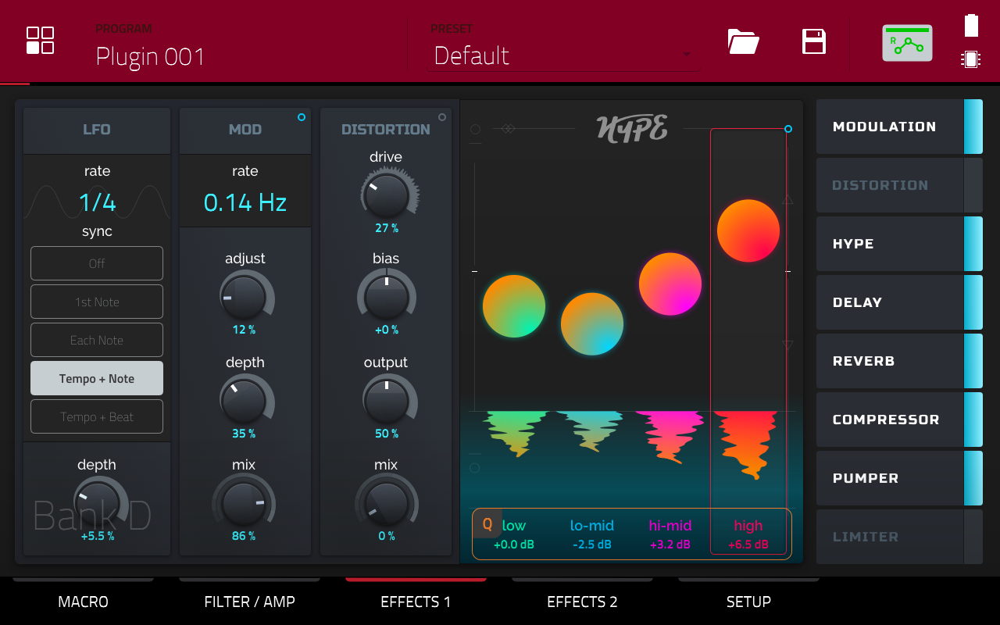

# Full Documentation

---

## Description of the modified sound generators plugins

&nbsp; | Official Theme | Custom Themes V2 |
:--------------------------------------- | :---: | :------: |
:musical_keyboard: **AIR Drumsynth (Virtual Instrument)** |  |  |
DrumSynth is a revolutionary synthesizer drum machine plugin instrument for powerful drum sound design. Enjoy the power to create and sculpt amazing drum sounds from the ground up, run them through a multitude of sound-shaping and audio effects processors then save to your collection of custom user presets, empowering you to quickly build your personal collection of customized percussive textures. |  |  |
:musical_keyboard: **AIR Bassline (Virtual Instrument)** | |  |
The AIR Solina Plugin is based on the classic 6-timbre polyphonic keyboard instrument featuring Contrabass, Cello, Viola, Violin, Trumpet and Horn selections with independent volume, pan and pitch control. Combine them for a massive sonic experience to liven up even the most thrilling music production. AIR Solina also includes the new Flavor section for added texture and color to its sound. Also built-in is a wide array of effects including Delay, Reverb, and Chorus. AIR Solina is the sound designers dream with no shortage of knobs to twist and turn for incredibly unique keyboard tones. |  |  |
:musical_keyboard: **AIR Tubesynth (Virtual Instrument)** | |  |
The AIR TubeSynth plugin emulates the sound of vintage analog polyphonic synthesizers. Dive into a collection of warm pads, brass synths, and so much more in this massive collection of synthesizer presets. |  |  |
:musical_keyboard: **AIR Electric (Virtual Instrument)** | |  |
The AIR Electric plugin is your total electric piano collection on MPC. Choose from a wide collection of keyboards like Rhodes, Wurlitzers, FM keyboards, and more. Dedicated control sections provide deep virtual control over keyboard pickups, envelope, bell and noise settings, and much more. |  |  |
:musical_keyboard: **AIR Solina (Virtual Instrument)** | |  |
The AIR Solina Plugin is based on the classic 6-timbre polyphonic keyboard instrument featuring Contrabass, Cello, Viola, Violin, Trumpet and Horn selections with independent volume, pan and pitch control. Combine them for a massive sonic experience to liven up even the most thrilling music production. AIR Solina also includes the new Flavor section for added texture and color to its sound. Also built-in is a wide array of effects including Delay, Reverb, and Chorus. AIR Solina is the sound designers dream with no shortage of knobs to twist and turn for incredibly unique keyboard tones. |  |  |
:musical_keyboard: **AIR Odyssey (Virtual Instrument)** | |  |
WayOutWare created a faithful recreation of this legendary synth. Not only is it accurate sonically, but with their experienced circuit modeling and signal processing, WayOutWare captured the behavior, character and charm of the original. Now all this incredible sound and synth performance is available in MPC with the WayOutWare Odyssey Plugin Instrument which comes with over 150 presets including synth leads, ambient pads, drum percussion sounds and more. With its extensive control layout, tweak and automate parameters for unique sound design to make music productions one of a kind. |  |  |
:musical_keyboard: **AIR Mellotron (Virtual Instrument)** | |  |
The new Mellotron plugin instrument is a recreation of the legendary tape sample keyboard machine featured on countless classic Rock albums. This MPC Mellotron Plugin Instrument version is designed for fresh, creative music production with a wide array of parameters, settings, and controls to craft an expansive range of keyboard instrument sounds. Start with the six sound categories and venture off into a wide variety of sound shaping sections, notably, the new Flavor section. Add different effects like Flutter or Noise to give your Mellotron Keyboards more texture and character for a new classic sound that is truly your own. |  |  |
:musical_keyboard: **AIR Hype (Virtual Instrument)** | |  |
The AIR Hype Plugin Instrument for MPC is an advanced sound library with a large offering of inspiring sound instruments and effects. These breath-taking sounds will quickly spark any producer's creativity and make music production a fluid, uninhibited process. AIR Hype delivers hundreds of emotive sounds and presets while its intuitive layout and numerous macro controllers make the sound design and shaping process fast and responsive. Create music and craft your unique sonics seamlessly with a world class synthesizer plugin. |  |  |

