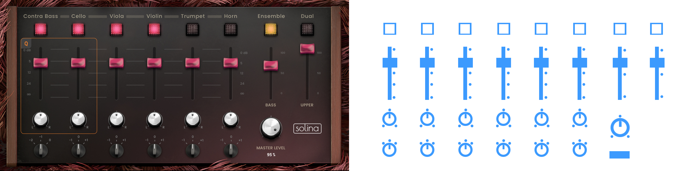

# Tutorial "Solina" plugin - Plugin structure JSON/PNG files

This tutorial is intended for **beginner users**. If you have some programming basics, it will help you understand the different terms used here. Also, if your graphic skills allow you to edit and publish beautiful images, feel free to modify some images in the interface. Each theme is located in a separate **folder** containing all the files needed to display the plugin.

---

First of all, open the **[Solina API (Gfx) Documentation](API-AIR-SOLINA.md)** and read the details about the images format, plugin´s parameters and functions.

Now, we understand how to modify our plugin GUI, to accomodate the design to our preferences. The next step is start applying changes, but before that, dont forget to make a copy of the original folder !!! Let´s go for the plugin **"SOLINA"** :) I personaly dont like the original design of this nice little synth, the poor and non-logical graphic design and the complete chaos in the page contents organisation... but this is how i feel, doesn t mean we are equal on those feelings.

It has 5 pages in a row, from left to right **(6400x629px)**, this is a huge surface!
Let´s look at the first page, **6 main controls** for instruments (mix, mute, pan and octave), **2 controls** for EQ (Bass, Upper), and a **set of switches** for Ensemble and Dual Voices, and finally, a **Main volume** knob.

---

Open the **TUI.json** file included into the theme folder.

