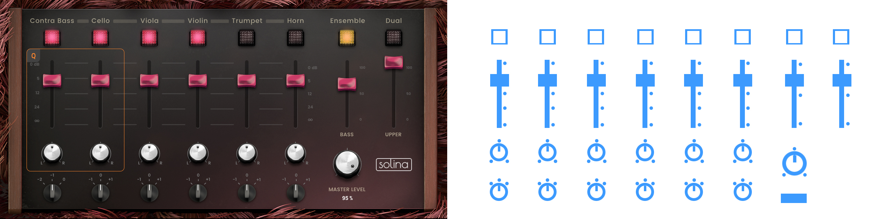
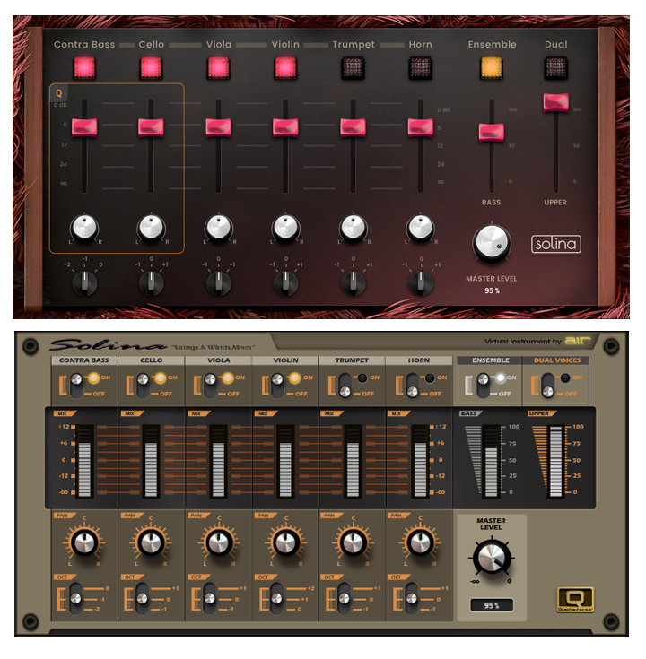

# API Solina GUI

## The structured data/setup files:

| GUI structure: JSON files |  Data | Weight (Kb) |
| --- | --- | :---: |
| Main: | TUI.json  | **192** |
| Qlinks: | Q-Links.json | **4.28** |
| Extra: | Q-Links - 8by1.json | **4.28** |

---

## Pages/Tabs:

```yaml
"page 1": "ENSEMBLE"
"page 2": "SOUND"
"page 3": "FLAVOR"
"page 4": "CHORUS/EQ"
"page 5": "DELAY/REVERB"
```

## GUI Components:

```yaml
- btnOn
- btnEnsemble
- btnDual
- valueSlider
- comboBox
- flavorType
- knobPan
- sliderMix
- sliderSound
- sliderFx
- sliderSoundBi
- knobLg
- knobLgTall
- knobOct
```
---

## Images:

The plugin background is made up of a single image for each page. The image may contain a simple instrument panel but also button shadows, and other details. Each page or tab contains its own background and additional components.

| BACKGROUNDS | Page 1  | Page 2  | Page 3  | Page 4  | Page 5  | Dimensions (px) |
| --- | --- | --- | --- | --- | --- | :---: |
| BG Pages: | fbank_01.png | fbank_02.png | fbank_03.png | fbank_04.png | fbank_05.png | **1280x630** |

### The Switch buttons:

| GUI Elements: Switches (Buttons with 2 states) | Images OFF  | Images ON  | Dimensions (px) |
| --- | --- | --- | :---: |
| Instrument Switch: | btn_off.png  |  btn_on.png | **70x70** |
| Ensemble Switch: | btn_off.png  |  btn_ensemble.png | **70x70** |
| Dual Switch: | btn_off.png  |  btn_dual.png | **70x70** |

### The Sliders and Knobs:

| GUI Elements: Sliders & Knobs (Vertical steps) | Images  | Dimensions (px) |
| --- | --- | :---: |
| Flavor Slider: | flavor.png  | **216x7360** |
| Knob: | knob.png  | **127x16129** |
| Octave knob: | knob_octave.png  | **75x225** |
| Pan knob: | knob_pan.png  | **92x11684** |
| Slider Long: | slider_long.png  | **80x31115** |
| Slider Short: | slider_short.png  | **80x31115** |

---

## Parameters <> Functions

| Keys | Functions (Type)  | Values |
| :---: | :----------------- | :---: |
| **Parameter 0** | Ensemble (btnEnsemble)  | 0/1 |
| **Parameter 1** | Viola (btnOn)  | 0/1 |
| **Parameter 2** | Viola Vol (sliderMix)  | 0...100 |
| **Parameter 3** | Viola Pan (knobPan)  | -50...0...50 |
| **Parameter 4** | Viola Octave (knobOct)  | -2/-1/0 |
| **Parameter 5** | Violin (btnOn)  | 0/1 |
| **Parameter 6** | Violin Vol (sliderMix)  | 0...100 |
| **Parameter 7** | Violin Pan (knobPan)  | -50...0...50 |
| **Parameter 8** | Violin Octave (knobOct)  | 0/+1/+2 |
| **Parameter 9** | Trumpet (btnOn)  | 0/1 |
| **Parameter 10** | Trumpet Vol (sliderMix)  | 0...100 |
| **Parameter 11** | Trumpet Pan (knobPan)  | -50...0...50 |
| **Parameter 12** | Trumpet Octave (knobOct)  | -1/0/+1 |
| **Parameter 13** | Horn (btnOn)  | 0/1 |
| **Parameter 14** | Horn Vol (sliderMix)  | 0...100 |
| **Parameter 15** | Horn Pan (knobPan)  | -50...0...50 |
| **Parameter 16** | Horn Octave (knobOct)  | -1/0/+1 |
| **Parameter 17** | Contra Bass (btnOn)  | 0/1 |
| **Parameter 18** | Contra Bass Vol (sliderMix)  | 0...100 |
| **Parameter 19** | Contra Bass Pan (knobPan)  | -50...0...50 |
| **Parameter 20** | Contra Bass Octave (knobOct)  | -2/-1/0 |
| **Parameter 21** | Cello (btnOn)  | 0/1 |
| **Parameter 22** | Cello Vol (sliderMix)  | 0...100 |
| **Parameter 23** | Cello Pan (knobPan)  | -50...0...50 |
| **Parameter 24** | Cello Octave (knobOct)  | -1/0/+1 |
| **Parameter 25** | Split/Dual (btnDual)  | 0...100 |
| **Parameter 26** | Volume Bass (sliderMix)  | 0...100 |
| **Parameter 27** | Volume upper (sliderMix)  | 0...100 |
| **Parameter 28** | Crescendo (sliderSound)  | 0...100 |
| **Parameter 29** | Sustain (sliderSound)  | 0...100 |
| **Parameter 30** | Formant (sliderSoundBi)  | - |
| **Parameter 31** | Filter (sliderSound)  | 0...100 |
| **Parameter 32** | Age (sliderSound)  | 0...100 |
| **Parameter 33** | Vel -> Amp (knobLg)  | 0...100 |
| **Parameter 34** | MW Vibrato (knobLg)  | 0...100 |
| **Parameter 35** | AT Vibrato (knobLg)  | 0...100 |
| **Parameter 36** | Vibrato SPeed (knobLg)  | 0...100 |
| **Parameter 37** | Chorus On (btnOn)  | 0/1 |
| **Parameter 38** | Chorus Rate (sliderFx)  | 0...100 |
| **Parameter 39** | Chorus Depth (sliderFx)  | 0...100 |
| **Parameter 40** | Chorus Tone (sliderFx)  | 0...100 |
| **Parameter 41** | Chorus Mix (sliderFx)  | 0...100 |
| **Parameter 42** | Flavor On (btnOn)  | 0/1 |
| **Parameter 43** | Flavor Timbre (flavorType)  | 3105 |
| **Parameter 44** | Flavor Depth (sliderSound)  | 0...100 |
| **Parameter 45** | Flavor Vinyl Dist (knobLgTall)  | 0...100 |
| **Parameter 46** | Flavor Vinyl Noise (knobLgTall)  | 0...100 |
| **Parameter 47** | Flavor Flutter (knobLgTall)  | 0...100 |
| **Parameter 48** | Flavor Monofy (knobLgTall)  | 0...100 |
| **Parameter 49** | EQ On (btnOn)  | 0/1 |
| **Parameter 50** | EQ Low (sliderFx)  | 0...100 |
| **Parameter 51** | EQ Low Mid (sliderFx)  | 0...100 |
| **Parameter 52** | EQ High Mid (sliderFx)  | 0...100 |
| **Parameter 53** | EQ high (sliderFx)  | 0...100 |
| **Parameter 54** | Delay On (btnOn)  | 0/1 |
| **Parameter 55** | Delay Time (sliderFx)  | - |
| **Parameter 56** | Delay L/R Ratio (sliderFx)  | - |
| **Parameter 57** | Delay Feedback (sliderFx)  | 0...100 |
| **Parameter 58** | Delay Reso LP Freq (knobLgTall)  | - |
| **Parameter 59** | Delay Reso Bell Freq (knobLgTall)  | - |
| **Parameter 60** | Delay Reso Bell Gain (knobLgTall)  | - |
| **Parameter 61** | Delay Mix (sliderFx)  | 0...100 |
| **Parameter 62** | Spring Reverb (btnOn)  | 0/1 |
| **Parameter 63** | Reverb Pre-Dealy (sliderFx)  | - |
| **Parameter 64** | Reverb Time (sliderFx)  | - |
| **Parameter 65** | Reverb Low Cut (sliderFx)  | - |
| **Parameter 66** | Reverb Diffusion (sliderFx)  | 0...100 |
| **Parameter 67** | Reverb Width (sliderFx)  | - |
| **Parameter 68** | Reverb Mix (sliderFx)  | 0...100 |
| **Parameter 69** | Sample Poly (valueSlider)  | 25...50 |
| **Parameter 70** | Master Level (knobLg)  | 0...100 |

---

## Exemple: 1 Tab (various Sub-components) - TAB 3 (Flavor)
```yaml
Line 3021 - Component >>> "fnKeyIndex": 2
"tabName": "FLAVOR"
"colour": "ff1e1d1e"
"image": ""


Line 3045 - Sub-component >>> "type": "Image"
"name": "Image"
"value": "Invalid"
"image": "fbank_03_bg.png"
"bounds": "0 0 1280 630"

Line 3077 - Sub-component >>> "type": "btnOn"
"name": "Flavor On"
"value": "Parameter 42"
"bounds": "1074 68 121 74"

Line 3106 - Sub-component >>> "type": "flavorType"
"name": "Flavor Timbre"
"value": "Parameter 43"
"bounds": "122 241 216 230"

Line 3134 - Sub-component >>> "type": "sliderSound"
"name": "Flavor Depth"
"value": "Parameter 44"
"bounds": "357 298 121 295"

Line 3163 - Sub-component >>> "type": "knobLgTall"
"name": "Flavor Vinyl Dist"
"value": "Parameter 45"
"bounds": "509 370 155 217"

Line 3192 - Sub-component >>> "type": "knobLgTall"
"name": "Flavor Vinyl Noise"
"value": "Parameter 46"
"bounds": "669 370 155 217"

Line 3221 - Sub-component >>> "type": "knobLgTall"
"name": "Flavor Flutter"
"value": "Parameter 47"
"bounds": "829 270 155 217"

Line 3250 - Sub-component >>> "type": "knobLgTall"
"name": "Flavor Monofy"
"value": "Parameter 48"
"bounds": "989 270 155 217"
```

---

## Exemple: 1 Type (slider built on 3 Sub-components) - Vertical Slider
```yaml
Line 928 - "key": "sliderSound"
size= 80x245px

Line 971 - Focus
"name": "Focus"
"type": "Focus"
"backgroundColour": "10ffffff"
"outlineColour": "ffe81f40"
"backgroundInset": 4.0
"outlineThickness": 1.0

Line 998 - Knob
"name": "Knob"
"type": "Knob"
"knobType": "FilmStrip"
"filmStrip": "slider_long.png"
"numFrames": 127
"bounds": "20 0 80 245"

Line 1026 - Data Bloc 
"name": "Label"
"type": "Label"
"name": "Titillium Web"
"style": "SemiBold"
"height": 24.0
"colour": "ffffffff"
"justification": "horizontallyCentred verticallyCentred"
"bounds": "0 255 121 28"
```

---

## Structure of the main interface



## Proposal for Custom GUI


